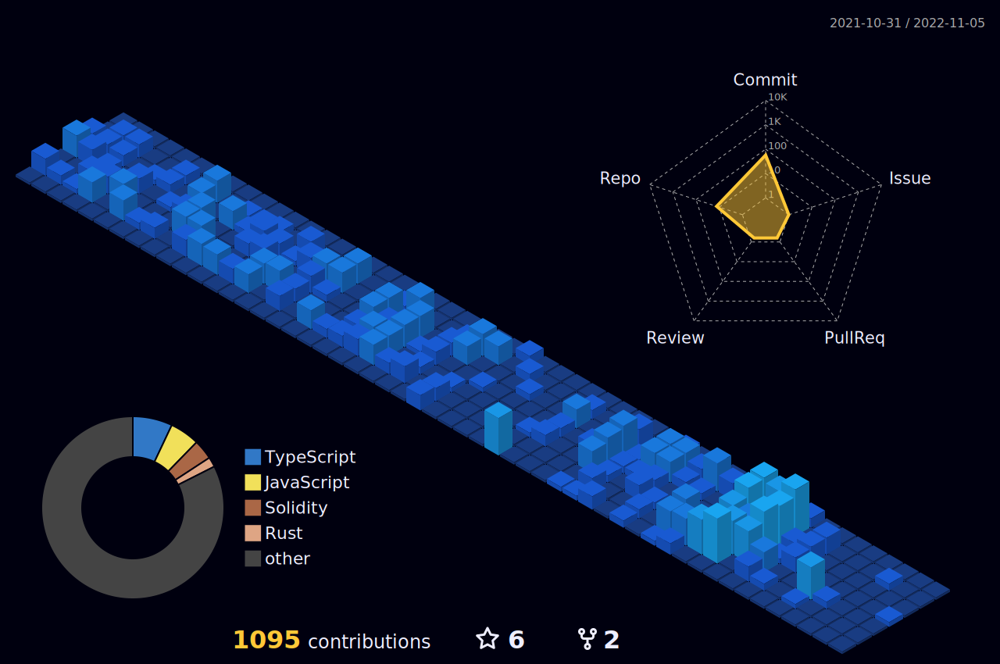

  
  
  <a href="https://github.com/antero9471">
    

      
    

  </a>

  

  
  

  

  

  <h2>
    
    How to reach me
    
  </h2>
   
  
  &nbsp;&nbsp;
  
  &nbsp;&nbsp;
  
  &nbsp;&nbsp;
  
  &nbsp;&nbsp;
  

